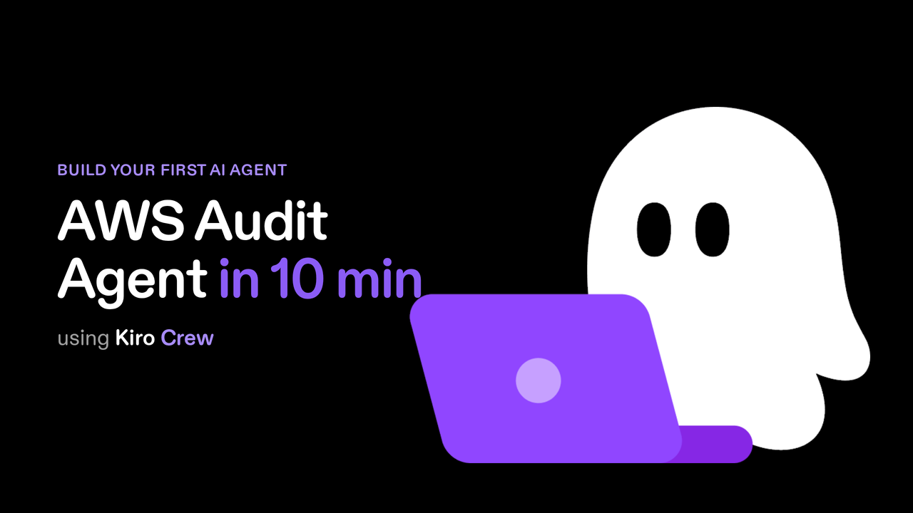

<div align="center">

# 👻 AWS Auditor Agent

### A read-only AI agent that audits your live AWS account for security risks and wasted spend, cites real resource IDs, and physically cannot change a thing.

[](https://kiro.dev)
[](https://github.com/awslabs/mcp)
[](iam/README.md)
[](LICENSE)

[](https://github.com/simplynadaf/aws-auditor-agent/stargazers)
[](https://github.com/simplynadaf/aws-auditor-agent/network/members)
[](https://github.com/simplynadaf/aws-auditor-agent/issues)

---

**⭐ If this helped you, give it a star! It helps others find it.**

[Video Tutorial](#-video-tutorial) • [Getting Started](#-getting-started) • [How It Works](#-how-it-works) • [Example Report](#-example-report) • [Contributing](#-contributing)

</div>

---

## 🎬 Video Tutorial

Watch the full build - from an empty JSON file to a real audit that finds a public S3 bucket in about two minutes:

[](https://kiro.dev)

In the video you'll see:
- The anatomy of an agent (the six pieces, explained in plain language)
- Building the read-only IAM boundary first (the safety foundation)
- Writing the agent config and the audit skill
- Wiring four AWS MCP servers so the agent can see your account
- Running it live and reading the real, cited report

---

## 🤔 The Problem

Two fears kill most "give the AI access to my cloud" ideas. One: your AWS account is quietly insecure or wasting money and you cannot see it. Two: handing an AI real access could wreck everything.

This agent answers both. It runs a full security and cost audit in about two minutes, and it runs on a read-only IAM boundary so it **physically cannot change anything**. Even if the model hallucinates a fix or a prompt injection tries to make it act, IAM rejects the write.

**Read-only glasses, not a wrench.**

---

## ✨ What It Does

> One agent. One prompt. A prioritized, cited report across security and cost.

<table>
<tr>
<td width="33%">

### 🔒 Security checks
Backed by read-only APIs:
- Public S3 buckets
- Root & IAM user MFA
- Security groups open to 0.0.0.0/0
- Unencrypted EBS / RDS
- GuardDuty enabled
- Access Analyzer enabled
- Security Hub standards complete

</td>
<td width="33%">

### 💸 Cost checks
Each with a real $/month:
- Unattached EBS volumes
- Unassociated Elastic IPs
- Orphaned EBS snapshots
- gp2 volumes that should be gp3
- Idle load balancers

Dollar figures come from the live AWS Price List API.

</td>
<td width="33%">

### 📊 The report
Structured for humans:
- Executive summary
- Top 3 - do these now
- Findings by severity
- Passing checks (honest)
- Gaps: "not verified" is never "passed"

Every ID and number traces to real tool output.

</td>
</tr>
</table>

---

## 🧠 How It Works

```
┌──────────────────────────────────────────────────────────────────────────┐
│                                                                          │
│   📡 AWS Account          👻 AWS Auditor Agent          📊 Output        │
│                                                                          │
│   ┌─────────────┐     ┌──────────────────────────┐    ┌──────────────┐  │
│   │ S3 / EC2    │     │  aws-auditor.json        │    │              │  │
│   │ IAM / RDS   │────▶│    + aws-audit/SKILL.md  │───▶│  Prioritized │  │
│   │ GuardDuty   │     │                          │    │  cited audit │  │
│   │ Sec Hub     │     │  4 AWS MCP servers:      │    │  report      │  │
│   │ Pricing API │     │  security · cloudtrail   │    │  security +  │  │
│   │             │     │  pricing · awsdocs       │    │  cost + $    │  │
│   └─────────────┘     └──────────────────────────┘    └──────────────┘  │
│                                                                          │
│              🔒 Read-only IAM boundary (SecurityAudit + ViewOnlyAccess)  │
│                                                                          │
└──────────────────────────────────────────────────────────────────────────┘
```

The whole agent is **one JSON file plus one Markdown checklist**. The engineering that makes it trustworthy is not in the model. It is in the IAM boundary that makes writes impossible, and a prompt that forbids inventing findings.

---

## 🎬 Example Report

Real output against 5 intentionally misconfigured demo resources. Nothing edited. Full copy in [`example-report/sample-audit-us-east-1.md`](example-report/sample-audit-us-east-1.md).

```
# AWS Audit - us-east-1, 2026-09-02

## Executive summary
Scoped to the 5 resources tagged demo-auditor=true, this audit found 8 findings:
1 CRITICAL, 3 HIGH, 2 MEDIUM, and 3 cost items. The single most urgent problem is a
publicly readable S3 bucket (demo-auditor-public-5403).

## Top 3 - do these now
1. Public S3 bucket demo-auditor-public-5403 - bucket policy grants s3:GetObject to *
2. Security group sg-055250cbcc6f3b37b - SSH port 22 open to 0.0.0.0/0
3. GuardDuty is disabled in us-east-1 - no threat detection is running

## Cost findings
### [COST] Unassociated Elastic IP - ~$3.65/month
- Resource: eipalloc-000992c9956cfaaa5 (public IP 35.173.72.149, no association)
- Estimated impact: $0.005/hr (USE1-PublicIPv4:IdleAddress) x 730 hrs = $3.65/mo

## Gaps (not verified)
- IAM per-user MFA, RDS encryption, idle load balancers: out of demo scope,
  reported as NOT verified rather than implied as passed.
```

Every resource ID is real. Every rate came from the live Price List API. The agent computed the numbers, it did not make them up. It reported a PASS (root MFA on), refused to call a same-day snapshot "old," and listed honest gaps.

---

## 🛠️ Tech Stack

| Component | Technology |
|-----------|-----------|
| 🤖 Agent Runtime | [Kiro Crew](https://kiro.dev) / Amazon Q Developer CLI |
| 🧠 Model | `auto` (CLI-selected) |
| 🔧 AWS Tools | 4 [AWS MCP servers](https://github.com/awslabs/mcp): security, cloudtrail, pricing, awsdocs |
| 📋 Audit Logic | `aws-audit/SKILL.md` - a plain Markdown checklist |
| 🔒 Auth | Read-only IAM: `SecurityAudit` + `ViewOnlyAccess` |
| 💵 Pricing | AWS Price List API (real $/month for every cost finding) |

---

## 📋 Prerequisites

- ✅ [Kiro Crew](https://kiro.dev) or Amazon Q Developer CLI
- ✅ `uv` / `uvx` for the AWS MCP servers (`pip install uv`)
- ✅ AWS credentials with the two read-only policies below
- ✅ `jq` (only for the optional demo scripts)

---

## 🚀 Getting Started

### 1. Set up the read-only IAM identity (do this first)

This is the guardrail. Full instructions in [`iam/README.md`](iam/README.md).

```bash
aws iam create-user --user-name aws-auditor
aws iam attach-user-policy --user-name aws-auditor \
  --policy-arn arn:aws:iam::aws:policy/SecurityAudit
aws iam attach-user-policy --user-name aws-auditor \
  --policy-arn arn:aws:iam::aws:policy/job-function/ViewOnlyAccess
```

> 💡 Both policies are `Get*` / `List*` / `Describe*` only. No write action exists.

### 2. Install the skill and the agent

```bash
mkdir -p ~/.kiro/skills/aws-audit ~/.kiro/agents
cp skill/SKILL.md ~/.kiro/skills/aws-audit/SKILL.md
cp agent/aws-auditor.json ~/.kiro/agents/aws-auditor.json
```

> Using Amazon Q Developer CLI? Put the agent in `~/.aws/amazonq/cli-agents/` and change the `resources` entry from `skill://` to a `file://` path.

### 3. Run it

```bash
kirocrew chat --agent aws-auditor      # Kiro Crew
q chat --agent aws-auditor             # Amazon Q Developer CLI
```

Then ask:

```
Audit us-east-1. Actually call the tools and produce the report.
```

That's it. The four MCP servers are pulled automatically on first run.

---

## 🧪 Try It Safely (optional demo resources)

Not ready to run against real infrastructure? The scripts create 5 cheap, clearly tagged, intentionally broken resources so you get a rich report with nothing real involved.

```bash
bash scripts/create-demo-resources.sh    # creates 5 demo-auditor=* resources
# ... run the audit ...
bash scripts/teardown-demo-resources.sh  # removes 100% of them (idempotent)
```

| Resource | Misconfiguration | Findings |
|----------|------------------|----------|
| Public S3 bucket | Public access block off + public read policy | CRITICAL |
| Security group | Inbound 0.0.0.0/0 on port 22 | HIGH |
| EBS volume (gp2, 8 GiB) | Unattached + unencrypted + gp2 | HIGH + 2 COST |
| Elastic IP | Allocated, not associated | COST |
| EBS snapshot | Orphaned | COST |

The skill ships **scoped to `demo-auditor=true`**, so the demo is repeatable and never reports anything real. Delete the one "Demo scope" block in `skill/SKILL.md` to audit your whole account.

---

## 📁 Project Structure

```
aws-auditor-agent/
├── 🤖 agent/aws-auditor.json          ← The agent. One file. This is the whole thing.
├── 📋 skill/SKILL.md                   ← The audit checklist: checks, severities, format
├── 🔒 iam/
│   ├── README.md                       ← The read-only permission boundary (safety story)
│   └── trust-policy.json               ← Starter trust policy if you use a role
├── 📜 scripts/
│   ├── create-demo-resources.sh        ← 5 tagged "bad" resources to demo against
│   └── teardown-demo-resources.sh      ← Removes 100% of them (tag-based, idempotent)
├── 📊 example-report/
│   └── sample-audit-us-east-1.md       ← The real, unedited audit report
├── 📄 LICENSE
└── 📄 README.md
```

---

## 🔐 The Read-Only Permission Boundary

The agent is safe because IAM makes writes impossible, not because we asked it nicely. Attach these two AWS-managed policies:

| Policy | ARN |
|--------|-----|
| `SecurityAudit` | `arn:aws:iam::aws:policy/SecurityAudit` |
| `ViewOnlyAccess` | `arn:aws:iam::aws:policy/job-function/ViewOnlyAccess` |

On top of IAM, the agent config restricts the `use_aws` tool to a short list of read services (`toolsSettings.use_aws.allowedServices`). Two independent walls. Details in [`iam/README.md`](iam/README.md).

---

## ⚙️ Customization

| What | Where |
|------|-------|
| Add or remove checks | `skill/SKILL.md` - each row names the read-only API |
| Change severities | `skill/SKILL.md` - the severity model |
| Change report format | `skill/SKILL.md` - the report template |
| Audit the whole account | Delete the "Demo scope" block in `skill/SKILL.md` |
| Pin a model | `agent/aws-auditor.json` - the `model` field |
| Scan a different region | Change `AWS_REGION` in the `mcpServers` env blocks |

---

## 🐛 Troubleshooting

| Problem | Fix |
|---------|-----|
| MCP servers do not start | Install `uv`: `pip install uv` (the config runs them via `uvx`) |
| Agent not found | Confirm the JSON is in `~/.kiro/agents/` (or `~/.aws/amazonq/cli-agents/` for Q) |
| Skill not loaded | Check the `resources` path matches where you copied `SKILL.md` |
| Access denied on a check | Confirm both read-only policies are attached to the identity |
| Cost finding shows "not verified" | The pricing API could not return a rate; that is honest, not a bug |
| Demo teardown left something | Re-run `teardown-demo-resources.sh`; it sweeps by tag and is idempotent |

---

## 🤝 Contributing

Contributions welcome! Ideas for improvement:

- Add a multi-region audit loop
- Add RDS and Lambda specific checks
- Add a scheduled "daily diff" mode (read-only, so it is safe overnight)
- Map findings to the full CIS benchmark
- Add an HTML / PDF report export

1. 🍴 Fork the repo
2. 🌿 Create a branch (`git checkout -b feature/multi-region`)
3. 💾 Commit changes (`git commit -m 'Add multi-region audit'`)
4. 🚀 Push (`git push origin feature/multi-region`)
5. 📬 Open a Pull Request

---

## 📝 License

This project is licensed under the MIT License - see the [LICENSE](LICENSE) file for details.

---

## 👨‍💻 Author

**Sarvar Nadaf** - Cloud Architect | AI Infrastructure & DevOps

[](https://www.linkedin.com/in/sarvar04/)
[](https://github.com/simplynadaf)
[](https://dev.to/sarvar_04)

---

<div align="center">

**If this project helped you, consider giving it a ⭐**

*Built with ❤️ using Kiro Crew + AWS MCP servers*

</div>
